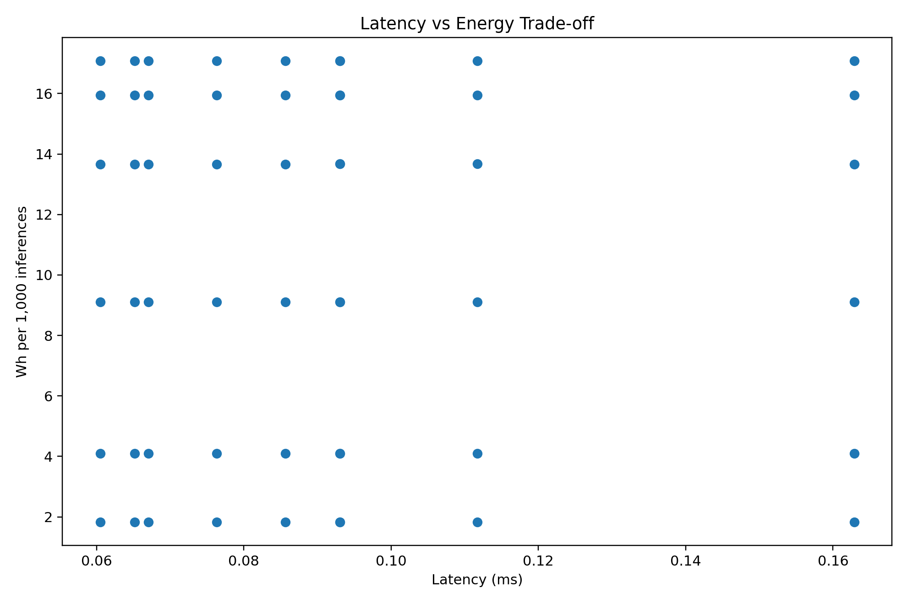
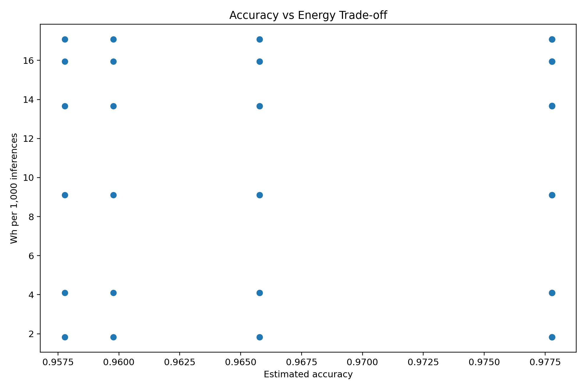
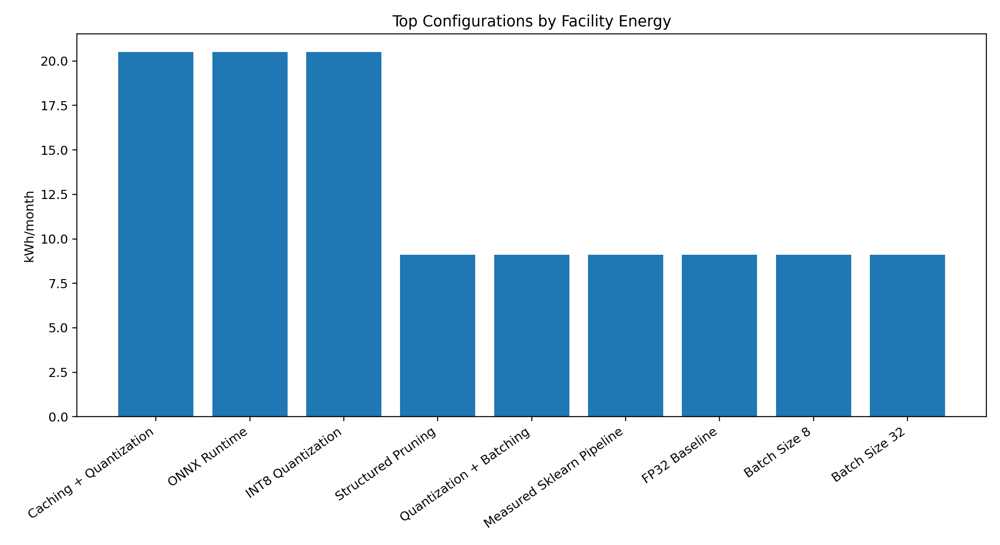
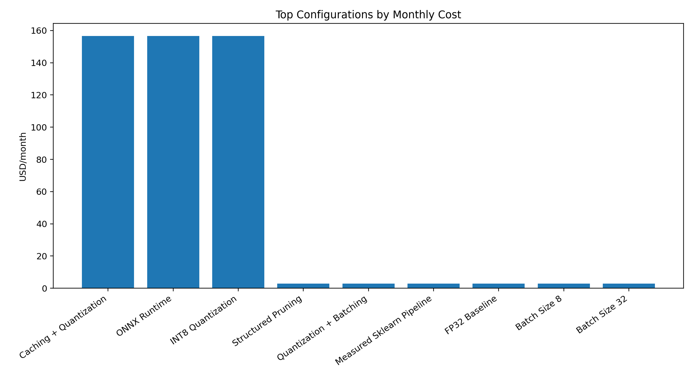
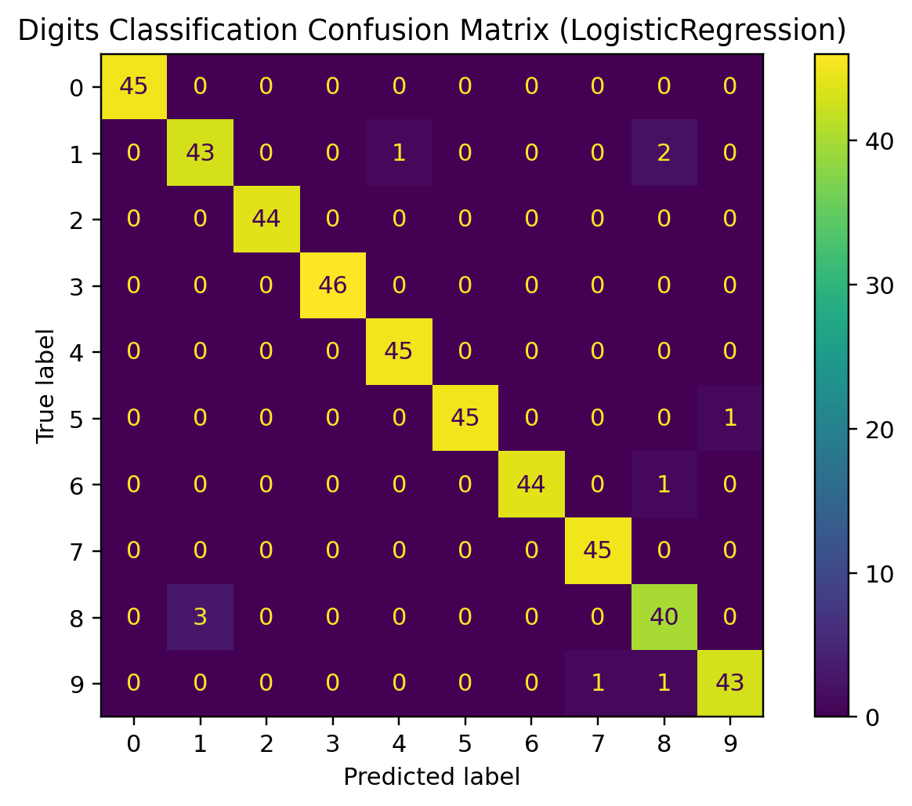

# AI Inference Optimization and Deployment Decision Engine

A production-style AI deployment decision platform that evaluates inference configurations and recommends the best option based on latency, accuracy, energy, carbon, and cost constraints.

This project goes beyond a simple optimization demo. It behaves like a mini AI infrastructure decision platform and includes a real dataset benchmark, optional PyTorch inference timing, optional ONNX export, ONNX Runtime timing, a Streamlit dashboard, static reports, a FastAPI endpoint, and deployment-ready configuration.

## Results Preview











## Quick Start

```bash
python -m venv .venv
.venv\Scripts\activate
pip install -r requirements.txt
python src/accuracy_benchmark.py
python src/run_pipeline.py
streamlit run app/app.py
```

## Optional Benchmarks

```bash
pip install torch torchvision
python src/real_benchmark.py
```

```bash
pip install torch torchvision onnx onnxruntime
python src/onnx_export.py
python src/onnx_benchmark.py
```

## API

```bash
uvicorn api.main:app --reload
```

Open:

```text
http://127.0.0.1:8000/docs
```

## Run Tests

```bash
pytest
```

## Important Note

This project uses a hybrid approach: real sklearn digits benchmark + optional local model timing + scenario-based energy, carbon, and cost modelling.

## Author

Ashiqur Rahman Rahul
