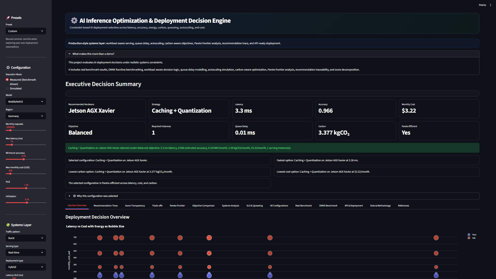
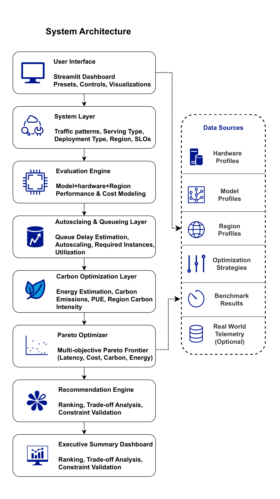

# AI Inference Optimization & Deployment Decision Engine

Production-style AI deployment optimization engine for selecting optimal inference deployments across **latency, accuracy, cost, energy, carbon emissions, queue delay, autoscaling, and infrastructure constraints**.

This project simulates and evaluates real-world AI deployment decisions using **multi-objective Pareto optimization**, **systems-aware modeling**, **carbon-aware infrastructure analysis**, and **deployment explainability**.

---

## Dashboard Preview



---

## Why This Project Matters

Modern AI systems are no longer evaluated only on model accuracy. Real-world deployment decisions must balance inference latency, infrastructure cost, carbon emissions, energy efficiency, queueing behavior, autoscaling requirements, hardware compatibility, deployment topology, traffic dynamics, and production service-level objectives.

This project demonstrates a practical production-style deployment optimization engine capable of evaluating and ranking deployment candidates under realistic infrastructure constraints.

---

## Core Features

### Multi-Objective Optimization

- Pareto frontier analysis
- Latency vs. cost vs. carbon optimization
- Dominance filtering
- Trade-off ranking
- Objective-aware deployment selection

### Carbon-Aware AI Deployment

- Region-based carbon intensity modeling
- PUE-aware infrastructure energy estimation
- Monthly energy and carbon tracking
- Carbon-first deployment objective
- Carbon-aware deployment comparison

### Queueing & Autoscaling Simulation

- Queue delay estimation
- Traffic pattern analysis
- Utilization-aware scaling
- Required instance estimation
- Latency SLO verification
- Burst and spiky workload support

### Deployment Explainability

- Recommendation traceability
- Constraint filtering visualization
- Rejected candidate analysis
- Executive recommendation insights
- Score decomposition
- Transparent deployment reasoning

### Production-Oriented Deployment Logic

- Real-time vs. batch serving
- Edge vs. cloud vs. hybrid deployment
- Workload-aware optimization
- Traffic-aware scheduling
- Infrastructure-aware evaluation

### Benchmarking & Performance Modeling

- Real benchmark support
- ONNX Runtime benchmarking
- Measured vs. simulated execution modes
- Latency and accuracy profiling
- Benchmark result integration

### API & Deployment Ready

- FastAPI integration
- Docker deployment
- Render deployment configuration
- Procfile support
- Modular architecture

---

## System Architecture



The platform is structured as a layered deployment optimization system.

| Layer | Responsibility |
|---|---|
| User Interface | Streamlit dashboard, presets, controls, visualizations |
| Systems Layer | Traffic patterns, serving type, deployment type, region, SLOs |
| Evaluation Engine | Model, hardware, region, performance, and cost evaluation |
| Queueing Layer | Queue delay estimation, autoscaling, required instances, utilization |
| Carbon Layer | Energy estimation, carbon emissions, PUE, region carbon intensity |
| Pareto Optimizer | Multi-objective Pareto frontier analysis |
| Recommendation Engine | Final deployment ranking, trade-off reasoning, constraint validation |

---

## Pareto Optimization Pipeline


The optimization pipeline evaluates all deployment candidates and progressively filters them based on deployment constraints.

### Pipeline Steps

1. Candidate generation
2. Constraint filtering
3. Pareto frontier analysis
4. Multi-objective ranking
5. Final recommendation

This makes the system suitable for exploring deployment trade-offs across competing objectives.

---

## Queueing & Autoscaling Logic


The system simulates production traffic behavior using queueing and autoscaling logic.

### Queueing and Scaling Capabilities

- Incoming request modeling
- Traffic pattern detection
- Queue delay estimation
- Autoscaling simulation
- Required instance calculation
- Utilization tracking
- SLO violation detection

---

## Recommendation Trace & Explainability


The explainability layer provides transparent deployment reasoning.

### Explainability Includes

- Constraint validation
- Rejected candidate inspection
- Trade-off analysis
- Pareto-efficient solution tracking
- Executive deployment recommendations

---

## Live Recommendation Trace


The recommendation trace visualizes how deployment candidates are progressively filtered across latency constraints, accuracy constraints, cost limits, SLO requirements, and production feasibility checks.

This creates transparent and auditable deployment reasoning.

---

## Pareto Frontier Analysis

### Latency vs. Cost Trade-Off


### Latency vs. Carbon Trade-Off


The Pareto visualizations identify non-dominated deployment candidates across latency, monthly infrastructure cost, carbon emissions, and energy consumption. Bubble sizes represent deployment resource impact.

---

## Candidate Filtering Path


This visualization demonstrates how deployment candidates are reduced through successive production constraints.

---

## Dashboard Capabilities

The dashboard supports:

- preset-based deployment scenarios
- real benchmark execution mode
- simulated execution mode
- carbon-aware optimization
- Pareto frontier analysis
- score transparency
- trade-off exploration
- recommendation explainability
- ONNX benchmarking
- API deployment preview
- system-level infrastructure analysis

---

## Repository Structure

```text
ai-deployment-decision-engine-top1/
│
├── api/                          # FastAPI deployment API
├── app/                          # Streamlit dashboard
├── configs/                      # Configuration files
├── data/                         # Hardware/model/region datasets
├── deployment/                   # Deployment configs and optional infrastructure scaffolds
├── docs/                         # Technical documentation
├── models/                       # ONNX and benchmark models
├── notebooks/                    # Research notebooks
├── outputs/                      # Generated figures and reports
├── src/                          # Core optimization engine
├── tests/                        # Unit tests
│
├── Dockerfile
├── docker-compose.yml
├── Procfile
├── render.yaml
├── requirements.txt
├── requirements-optional.txt
└── README.md
```

---

## Installation

### Clone Repository

```bash
git clone https://github.com/your-username/ai-deployment-decision-engine.git
cd ai-deployment-decision-engine
```

### Create Virtual Environment

Windows:

```bash
python -m venv .venv
.venv\Scripts\activate
```

Linux/macOS:

```bash
python3 -m venv .venv
source .venv/bin/activate
```

### Install Dependencies

```bash
pip install -r requirements.txt
```

Optional advanced modules:

```bash
pip install -r requirements-optional.txt
```

---

## Running the Dashboard

```bash
streamlit run app/app.py
```

Dashboard will open at:

```text
http://localhost:8501
```

---

## Running the API

```bash
uvicorn api.main:app --reload
```

API endpoint:

```text
http://127.0.0.1:8000
```

FastAPI documentation:

```text
http://127.0.0.1:8000/docs
```

---

## Running Tests

```bash
pytest
```

Run optional advanced module tests:

```bash
pytest tests/test_optional_advanced.py
```

---

## Docker Deployment

### Build Container

```bash
docker build -t ai-deployment-engine .
```

### Run Container

```bash
docker run -p 8501:8501 ai-deployment-engine
```

---

## Render Deployment

This repository includes:

- `render.yaml`
- `Procfile`
- Docker support

The project is compatible with deployment platforms such as Render, Railway, Hugging Face Spaces, and Streamlit Community Cloud.

---

## Technical Stack

| Component | Technology |
|---|---|
| Frontend | Streamlit |
| Backend API | FastAPI |
| Visualization | Plotly |
| Data Processing | Pandas / NumPy |
| Optimization | Pareto Multi-Objective Logic |
| Benchmarking | ONNX Runtime |
| Deployment | Docker |
| Testing | PyTest |

---

## Benchmarking & Data Sources

The engine uses hardware performance profiles, model accuracy profiles, regional carbon intensity profiles, optimization strategy datasets, ONNX benchmark outputs, queueing simulations, and autoscaling estimations.

The system supports both:

- **Measured mode**: uses benchmark-driven latency and accuracy results.
- **Simulated mode**: uses scenario-based assumptions for infrastructure exploration.

---

## Example Deployment Objectives

| Objective | Prioritizes |
|---|---|
| Balanced | Overall trade-off quality |
| Latency-first | Lowest inference delay |
| Cost-first | Lowest monthly infrastructure cost |
| Carbon-first | Lowest emissions |
| Accuracy-first | Highest prediction quality |

---

## Optional Advanced Modules

This project also includes optional advanced systems modules:

- Kubernetes deployment simulation
- GPU memory-aware scheduling
- live carbon signal adapter
- electricity price adapter
- RL-style objective optimizer
- Triton Inference Server scaffold
- Prometheus/Grafana telemetry stack

These modules are intentionally optional so the main dashboard remains stable while still showing extensibility toward production AI infrastructure.

See:

```text
docs/optional_advanced_upgrades.md
docs/gpu_memory_scheduling.md
docs/rl_optimizer.md
docs/triton_inference_server.md
docs/prometheus_grafana.md
deployment/kubernetes/
deployment/triton/
deployment/monitoring/
```

---

## Future Improvements

Potential future upgrades include:

- live GPU telemetry integration
- Kubernetes deployment orchestration
- dynamic cloud pricing APIs
- real-time electricity carbon APIs
- reinforcement-learning-based optimization
- multi-region inference orchestration
- GPU memory-aware scheduling
- LLM serving optimization
- cloud-native autoscaling policies
- Triton Inference Server production integration
- Prometheus/Grafana telemetry dashboards

---

## Research & Engineering Focus

This project combines concepts from AI systems engineering, inference optimization, sustainable AI infrastructure, queueing theory, carbon-aware computing, multi-objective optimization, infrastructure modeling, and production AI deployment systems.

---

## Disclaimer

This project is intended for research, portfolio demonstration, infrastructure prototyping, and deployment optimization exploration.

Infrastructure metrics and assumptions are configurable and should be adapted to real production telemetry before operational use.

---

## License

MIT License

---

## Author

**Ashiqur Rahman Rahul**

Research-focused AI systems engineering, deployment optimization, and energy-aware AI infrastructure analysis.
